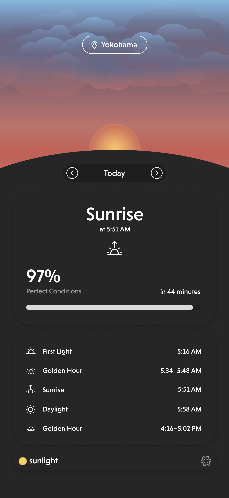
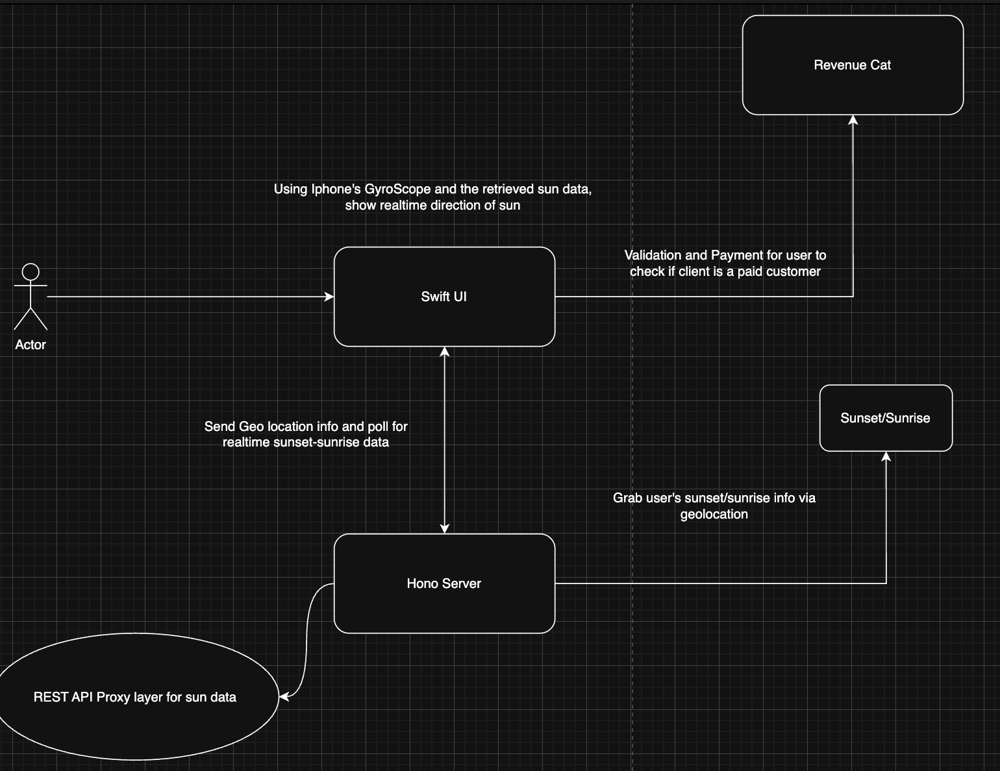

<h1 align="center">🌅 Youki — Sunrise & Sunset Tracking App</h1>

  A clean, simple iOS app that displays daily sunrise & sunset times.  
  Built with <b>SwiftUI</b> + <b>TypeScript</b>.

  

## 📱 Overview

This app allows users to:

* Track daily **sunrise and sunset** times.
* View clean and minimal UI optimized for iOS.
* Use the app forever after a **one‑time purchase**.

The app fetches sunrise/sunset data from a public API and serves it through a lightweight TypeScript backend.

## 🏛️ Architecture

  

### **1. iOS App (SwiftUI)**

* Written fully in **Swift**.
* Handles UI, location permissions, and calling your server for sun data, and accessing Gyroscope to calculate sun location.
* Displays sunrise/sunset results and additional info like day length.

### **2. Hono Server**
* Lightweight API layer built in Bun as the runtime, and Hono as the server library. 
https://hono.dev/

### **3. Sunrise/Sunset API**
* Shoutout to the maintainer of this api. \
[https://sunrisesunset.io/](https://sunrisesunset.io)

### **4. Payment**
* RevenueCat to handle user's payment info check.\
https://www.revenuecat.com/docs/