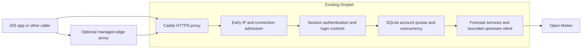

# Request protection with one Droplet

Updated: 2026-10-07
Status: Proposed; no application, infrastructure, or deployment changes made

## Quick read

Keep the existing Droplet, Caddy, Bun/Hono API, and SQLite. Add early per-IP admission, isolated login throttling, per-user concurrency, and redacted monitoring within this deployment. No second Droplet, Redis instance, or separate database is required for the current single-process app.

For stronger protection against floods that saturate the Droplet's network or HTTP server, place a managed edge proxy in front of the same Droplet. This is an external service, not another DigitalOcean instance. A domain the user controls is needed for the ordinary Cloudflare DNS proxy setup; the current `sslip.io` address is not such a domain.

First implementation slice: trusted client identity and bounded early admission in `server/src/app.ts`, then replace the globally shared temporary-login counter. This design is a proposal, not authorization to modify production.

## Scope and assumptions

- Goal: harden the live backend while retaining one Droplet and existing account/session/forecast contracts.
- Assumption: one Bun process handles application requests, matching the reviewed Compose deployment. Process-local limits require redesign if replicas are added.
- Goal: gradual deployment with smoke checks, a known rollback commit, and SQLite preserved.
- Non-goals: high availability, a new identity system, purchase implementation, or automatic infrastructure purchase/provisioning.
- Unknown: owned API domain, external security-service account/plan, desired beta size, Cloud Firewall configuration, and measured safe traffic capacity. These do not block application hardening.

## Current evidence

The [deployment and abuse review](../artifacts/2026-10-07-deployment-and-request-abuse-review.md) records live checks on October 7 and links to the reviewed source at `1cbf3362fe45e0e0a4187e963d5ffe792eb488b3`. The local checkout remains on old `main`; implement from an isolated checkout based on current `develop`, preserving existing untracked files.

Implemented: authenticated forecasts, SQLite per-account minute/day quotas, eight concurrent forecasts, body limits, upstream deadlines/cache/queue bounds, HTTPS, and loopback host publication of API port 3000.

Gaps: no configured edge limiter, a shared 30-attempt/minute login allowance, no per-user concurrency limit, no configured abuse metrics, and a small host with 458 MiB RAM and no explicit container resource limits.

## Target flow

Initially callers connect to Caddy directly. After an edge cutover, public origin ingress must accept only the intended edge so callers cannot bypass it. An app-level limiter protects downstream work; it cannot absorb a bandwidth-saturating attack before the Droplet receives it. [OWASP denial-of-service guidance](https://cheatsheetseries.owasp.org/cheatsheets/Denial_of_Service_Cheat_Sheet.html).

## Components, interfaces, and contracts

| Component | Responsibility | Implementation surface |
| --- | --- | --- |
| Caddy | HTTPS, authoritative client-IP forwarding, bounded/redacted access logs | Existing `server/deploy/Caddyfile` |
| Early admission | Apply limits to public, unauthenticated, invalid-token, auth, account, and forecast traffic before body buffering/DB/provider work | Existing `server/src/app.ts`; proposed `server/src/http/middleware/request-admission.ts` |
| Login admission | Per-IP attempts and per-IP plus normalized-account failures; retain a separate global emergency capacity ceiling | Existing temporary-login route in `app.ts`; proposed middleware module |
| Account concurrency | Limit one account to two concurrent forecast requests while retaining global maximum eight | Existing forecast guard in `app.ts` |
| Persistent quotas | Preserve existing account quotas and refresh semantics | Existing `sqlite-auth-store.ts` and `auth-service.ts` |
| Monitoring | Aggregate accepted/rejected counts, latency, in-flight work, upstream calls, and host memory | Proposed `server/src/infrastructure/observability/request-metrics.ts`; existing upstream client |
| Optional managed edge | Reject unwanted traffic before it reaches the host | Owned-domain DNS/security settings and DigitalOcean origin firewall |

Use Caddy to overwrite a dedicated client-IP header on every forwarded request; do not accept a caller's chosen value. Enforce the existing private API ingress invariant: port 3000 stays unpublished to the internet and Docker network access is restricted to trusted services. Use parsed, canonical IPv4/IPv6 addresses as limiter keys. Direct local diagnostics must have an explicit trusted policy, not a public header bypass. Caddy's forwarding and trusted-proxy behavior is documented [here](https://caddyserver.com/docs/caddyfile/directives/reverse_proxy).

Proposed initial policy, configurable and subject to beta traffic measurements:

- General IP token bucket: two requests/second refill, burst capacity 30. Apply before expensive processing, including unknown paths; treat OPTIONS as traffic rather than a free bypass.
- Temporary-login IP bucket: ten attempts/minute, burst ten; per-IP/account pair at most five failed attempts/minute. Avoid account-only lockouts that let strangers block a target account.
- Preserve the existing auth global capacity ceiling as an emergency control; replace the shared 30/minute login allowance. A global ceiling can still reject all callers during aggregate overload, which must be observable.
- Admission state is bounded to 4,096 active identities per limiter with ten-minute idle expiration. At capacity, use a conservative shared overflow bucket rather than unlimited allocation or eviction that resets attacker budgets. Test IPv6 variation and shared-network behavior.
- Return existing JSON error envelope, `429`, and accurate `Retry-After` for throttling. Return `503` for exhausted global forecast capacity. Never sleep inside request handlers to enforce rate limits.
- Keep current per-account request quotas and response fields unchanged. Account admission must continue to be shared across sessions and aliases. Acquire concurrency capacity before persistent quota admission and release it on every denial/error/completion path.
- Store neither bearer tokens nor passwords in logs. Hash or aggregate caller/account labels, use bounded cardinality, and rotate logs. Do not expose metrics publicly.

No SQLite migration is required for these first slices. IP counters reset after process restart, unlike persistent forecast quotas; that limitation is acceptable for the initial single-process beta and does not establish DDoS resilience.

## Ordered implementation and acceptance criteria

| Order | Work | Acceptance criteria |
| --- | --- | --- |
| 1 | Create isolated checkout from current `develop`; implement client identity and bounded IP admission | Spoofed headers cannot create arbitrary identities through Caddy; one client's excess traffic gets `429` before DB/body/provider work; health remains available to ordinary callers |
| 2 | Replace shared login counter; add per-user concurrency | One client's failed logins do not consume another client's normal login allowance; two in-flight forecasts/account and eight globally; all leases release reliably |
| 3 | Add redacted metrics/log rotation and operational alerts | Rejections, upstream traffic, memory, latency, and auth failures visible; credentials absent from logs; metric key growth bounded |
| 4 | Exercise locally, then deploy via existing `develop` GitHub Actions workflow | Readiness, login, refresh, forecasts, and rejection handling work; current SQLite volume preserved; rollback commit recorded |
| 5 | Optional owned-domain edge cutover | DNS proxied, origin TLS valid, trusted edge client identity configured, direct origin bypass closed, production app URL updated |
| 6 | Use observed work/capacity data to add weighted upstream budgets or resize | Distinct-coordinate workloads bounded globally; larger forecast calls accounted for; capacity decision supported by measurements |

Weighted upstream budgets remain a follow-up because request quotas currently count one weekly request as one admission. Their implementation should add a separately documented work budget rather than silently changing the advertised request allowances. Apple signing-key refresh coalescing/cooldown remains required before live Apple-auth cutover, as recorded in the review.

## Infrastructure choices

- Keep SQLite and process-local bounded admission for one API process. Redis or managed rate-limit storage becomes useful when multiple API processes must share admission state; it is not required now.
- Keep Caddy rather than adding another proxy container on this small host. Local early admission improves application abuse controls but still receives traffic on the host. An external edge addresses that boundary.
- An owned domain can be proxied through Cloudflare to the existing origin. Domain acquisition, account access, plan capabilities, DNS cutover, and certificate renewal strategy must be resolved before applying this optional slice. Native API clients must receive usable HTTP errors; interactive browser challenges are unsuitable for normal API traffic. [Cloudflare DNS proxy flow](https://developers.cloudflare.com/fundamentals/concepts/how-cloudflare-works/), [origin protection](https://developers.cloudflare.com/fundamentals/security/protect-your-origin-server/).
- If legitimate demand exceeds measured capacity, resize the existing Droplet. DigitalOcean documents vertical resizing; allow for required shutdown/downtime and take a backup first. A second instance is a future availability/scaling choice, not a prerequisite for these controls. [DigitalOcean resize guide](https://docs.digitalocean.com/products/droplets/how-to/resize/).

## Rollout, risks, and verification

Implement and verify locally using fake time, isolated accounts/database, and mock upstreams. Cover limiter refill, isolation, spoofing, malformed/unknown paths, OPTIONS, overflow memory bounds, shared-network tolerance, concurrency release, and existing session/route behavior. These checks are proposed and have not been run. Typecheck/bundle using the canonical repository commands.

Deploy in a controlled window via the existing workflow; expect a possible brief API interruption when its container is recreated. Back up SQLite before deployment and confirm restoration procedure. First rollout requires no schema migration. Roll back the application commit if ordinary beta behavior regresses; keep private ingress and HTTPS in place.

On production, use only low-volume smoke checks: readiness, login, refresh, normal forecast load, and app handling of throttling. Do not exhaust global login or forecast allowances to test limits on live shared accounts. Monitor rejection rates, latency, memory, and upstream errors after rollout and adjust configurable defaults if shared-network users are affected.

Current verification: the preceding review established runtime deployment, basic authentication and body rejection, and host/proxy configuration. This turn re-inspected relevant source and Git status and checked vendor documentation. No hardening code, new infrastructure, deployment, or tests were executed. Domain ownership, external edge settings, cloud firewall rules, and capacity under load remain unknown.
