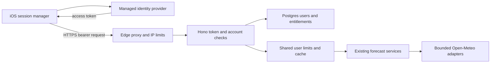

# User accounts, entitlements, and request protection

Date: 2026-09-27
Status: Historical proposal. The provider and storage choice was superseded by the 2026-09-28 [Apple/SQLite implementation](auth-implementation.md); remaining ideas here are not claims of implemented behavior.

## Quick read

Keep today's working app experience as the free tier. Add managed identity with Sign in with Apple, a server-owned user record, and a separate entitlement record for a future one-time Pro purchase. Require a verified bearer token on every forecast route. Protect the server with an edge proxy, shared per-user limits, upstream caching, deadlines, and bounded concurrency. Payment SDK integration and new paid features are deferred.

Start implementation in `server/src/app.ts`: introduce injectable security dependencies and protected route groups, then connect both iOS API clients to one session-aware transport. This document is the design deliverable; application code, infrastructure configuration, and tests remain unchanged.

## Scope and assumptions

- Goals: identify callers, count actual active users, preserve current free features, represent free/paid users, and bound backend/upstream resource consumption.
- Non-goals: collect payments now, build custom password authentication, implement calendar expansion/widgets/account sync, or move sky rendering to the server.
- Proposed assumption: a durable account is required for live forecasts. Signed-out users can inspect the local sample experience without issuing forecast requests. This onboarding choice needs product confirmation; a managed anonymous identity is an alternative below.
- Unknown: production host, existing proxy protections, user volume, operational budget, identity-provider preference, and final Pro features. No deployed infrastructure was audited.
- Proposed default stack: Supabase Auth + Postgres for identity and user/entitlement storage; Redis-compatible shared storage for limits/cache; an edge service such as Cloudflare in front of the Bun origin. These are recommendations, not existing dependencies.

## Implemented current state and evidence

| Surface | Observed behavior | Canonical source |
| --- | --- | --- |
| App composition | Wildcard CORS, public root/health/forecast routes, centralized errors; no auth/limit middleware | [app.ts](../server/src/app.ts), [index.ts](../server/src/index.ts) |
| Forecast routes | Three POST routes parse JSON and immediately execute a service | [sky-color.ts](../server/src/http/routes/sky-color.ts), [sky-day.ts](../server/src/http/routes/sky-day.ts) |
| Request validation | Number/NaN checks and date-format checks; no HTTP body-size cap or entitlement policy | Same route files; date-window checks also exist in the solar provider |
| Persistence | Package declares Hono only; no database, session, entitlement, or shared-limit adapter in inspected server sources | [package.json](../server/package.json) |
| Upstream work | Fetch has no explicit abort deadline, cache, or concurrency guard; upstream errors can expose response bodies through AppError messages | [open-meteo-client.ts](../server/src/infrastructure/open-meteo/open-meteo-client.ts), [errors.ts](../server/src/application/errors.ts) |
| Client identity | Both clients use URLSession and set JSON content type, but no Authorization header | [SkyColorAPI.swift](../frontend/YoukiApp/SkyColorAPI.swift), [SkyDayTimelineAPI.swift](../frontend/YoukiApp/SkyDayTimelineAPI.swift) |
| Client cadence | Initial load makes two parallel requests; refresh after 30 minutes, failed automatic refresh cooldown 5 minutes; minute clock primarily renders locally | [ServerViewModel.swift](../frontend/YoukiApp/ServerViewModel.swift) |
| Commercial UI | Settings displays Pro monthly/yearly from local selection; trial button dismisses sheet; restore is text | [ForecastSheets.swift](../frontend/YoukiApp/ForecastSheets.swift) |
| Network configuration | Backend defaults to localhost HTTP; Docker exposes port 3000 | [AppConfig.swift](../frontend/YoukiApp/AppConfig.swift), [Dockerfile](../server/Dockerfile) |

An ordinary two-event prediction currently makes seven upstream requests: timezone plus solar/weather/air-quality for each event. The timeline makes three: timezone/weather/air-quality; its solar work and summary scoring are local. A normal client load therefore makes about ten upstream requests without caching. Sources: [prediction service](../server/src/application/services/predict-sky-color-service.ts), [timeline service](../server/src/application/services/sky-day-timeline-service.ts), [solar provider](../server/src/infrastructure/open-meteo/open-meteo-solar-provider.ts). Protecting only inbound request counts leaves this amplification unaddressed.

The sibling `youki-prototype` is a static reference prototype, not the canonical backend/iOS implementation. CORS is a browser policy, not caller authentication or DDoS protection.

## Target flow and ownership

Identity provider owns Apple login, token issuance, refresh rotation, and auth abuse controls. Youki owns account status, entitlements, request policy, and usage reporting. Existing domain engines stay independent of Hono and auth-provider DTOs.

Proposed modules (new paths, not existing files):

| Component | Responsibility | Proposed seam |
| --- | --- | --- |
| TokenVerifier port / adapter | Validate token; return subject, session ID, expiry | `application/ports/token-verifier.ts`, `infrastructure/auth/` |
| AccountRepository | Idempotent provision, status, entitlement, revocation | `application/ports/account-repository.ts`, `infrastructure/persistence/` |
| HTTP middleware | Build typed principal, enforce route access and quotas | `http/middleware/` |
| RateLimitStore | Atomic shared admission, expiry, concurrency leases | `application/ports/rate-limit-store.ts`, `infrastructure/redis/` |
| SessionManager / APITransport | Login/restore/logout, token persistence, shared refresh, typed errors | New Swift files added to the Xcode project |

Make `createApp(dependencies)` injectable so tests supply token verifier, repositories, fake clock, limiter, and forecast services without real network access. Wire production adapters through infrastructure factories.

## Identity and session contract

1. Native Sign in with Apple uses a cryptographically random nonce; exchange the Apple ID token with managed auth. Supabase documents [native Apple login](https://supabase.com/docs/guides/auth/social-login/auth-apple) and [Swift ID-token exchange](https://supabase.com/docs/reference/swift/auth-signinwithidtoken).
2. Use the managed access token directly as `Authorization: Bearer <token>`. Avoid a second homegrown token system and never ship a shared backend secret in the app.
3. Verify signature using configured asymmetric signing keys, algorithm allowlist, exact issuer, configured audience, expiry/not-before, valid subject and session claim. Pin the JWKS URL to configuration; do not follow URLs supplied by the token. Cache keys, refresh once on unknown key with a shared cooldown, and bound lookup deadlines. See [signing-key documentation](https://supabase.com/docs/guides/auth/signing-keys).
4. Idempotently create the app user on first verified request using the provider subject as a unique key. Do not identify or merge accounts by Apple relay email. Reject suspended/deleted users before forecast work.
5. Configure a proposed 15-minute access-token lifetime. Provider manages refresh rotation; persist session secrets through Keychain-backed storage, with access token in memory. Verify SDK storage configuration rather than assuming its defaults use Keychain. Provider settings and documented [session semantics](https://supabase.com/docs/guides/auth/sessions) must be tested.
6. One shared refresh operation serves both parallel forecast requests. On 401, refresh and replay once; on terminal refresh rejection, clear session and ask for sign-in. Never retry 403 or repeatedly refresh during network failures.
7. Logout revokes the provider refresh session and marks its session ID revoked in Youki storage. Each request checks the revocation state so a still-valid JWT cannot continue using that session. Account suspension/deletion is checked similarly. Retain revoked IDs only until all corresponding access tokens can expire.
8. Cancel pending user requests on logout and ignore late responses using a session generation ID; clear account/entitlement caches. Existing alarms are device-local, so define explicitly whether they remain scheduled on logout; proposed default is to preserve them and label them local.

JWT verification proves possession of a valid session, not that the caller is human or the genuine iOS binary. Accounts can still automate requests; quotas and edge controls remain necessary.

## Persistence and free/paid state

Use schema migrations with these minimum tables:

- `app_users`: `id uuid` primary key equal to managed-auth subject, `status active|suspended|deleting`, `created_at`, nullable `last_active_at`. Managed auth owns identity/email; do not copy email without a product need.
- `entitlements`: `id`, `user_id` foreign key, `product_key` (initially `youki_pro_lifetime`), `status active|revoked`, `source manual|app_store`, unique nullable `(source, external_transaction_id)`, `granted_at`, nullable `revoked_at`, `updated_at`. Retain grant history; only active supported grants imply Pro.
- `revoked_sessions`: `session_id` unique, `user_id`, `expires_at`.
- Daily aggregate usage: user ID, UTC date, route class, accepted/rejected counts. Coalesce `last_active_at` updates (e.g. every 15 minutes) rather than write on every request. Redis admission state is separate from reporting.

Effective tier is `free` unless a valid active entitlement exists. Do not accept tier, user ID, or paid flags from request payloads or editable auth metadata. Keep database credentials server-only. If using Supabase tables, enable RLS and prevent direct client writes to status/entitlements; privileged server access must still scope every user operation to the verified subject.

Every new user starts free. A restricted server-side CLI may grant/revoke audited manual entitlements for testing; no public upgrade endpoint while payment is deferred. Free and manually paid users retain today's working functionality until specific paid features are implemented. Existing smart alarms must not become paid merely because the old mock paywall lists them.

Future: verified one-time transactions grant the lifetime entitlement idempotently; refunds/revocations remove it; restore reconciles verified transaction ownership. A lifetime purchase removes billing expiry, not server quotas. Native digital unlocks should default to a StoreKit non-consumable, with storefront-specific exceptions evaluated at implementation time under [Apple's payment guidelines](https://developer.apple.com/app-store/review/guidelines/#in-app-purchase). No purchase/restore SDK or webhook is introduced now.

## Routing and API contracts

| Route | Access and behavior |
| --- | --- |
| `GET /`, `/api/v1/health/live` | Public, minimal, edge limited; no upstream work |
| `/api/v1/health`, `/api/v1/health/ready` | Internal ingress/monitoring access; readiness checks required dependencies with short deadlines and cached results, never Open-Meteo per probe |
| `GET /api/v1/me` (new) | Authenticated; provision/load account and return effective tier |
| All three existing forecast POST routes | Authenticated, account status check, shared forecast bucket; preserve success DTOs |
| `DELETE /api/v1/me` (new) | Recent sign-in required; idempotent staged account deletion and session revocation |
| Identity login/refresh | Directly handled by managed auth, not forecast server routes |

Example `/me`: `{"user":{"id":"uuid"},"tier":"free","entitlements":[],"capabilities":{"liveForecast":true},"limits":{"forecastPerMinute":20,"forecastPerDay":300}}`. Pro responses list `youki_pro_lifetime`; capability policy is explicit and server-owned. Offline tier display is informational, never authorization.

Extend the current error envelope compatibly: `{"error":{"code":"rate_limited","message":"Too many requests.","requestId":"...","retryAfterSeconds":30}}`. Use 400 invalid input, 401 missing/invalid/expired/revoked session, 403 suspended account or unavailable capability, 413 oversized body, 415 wrong content type, 429 quota, 503 dependency/capacity unavailable, and 504 deadline. Return `Retry-After` on 429/temporary 503. Sanitize external error text; request IDs connect user-visible failures to internal logs. Add a JSON not-found response.

Middleware order: request ID -> body/header/deadline safeguards -> allowed-origin CORS/preflight -> trusted-IP admission -> token verification -> account/revocation lookup -> shared user admission -> JSON/schema validation -> capability check -> cache/expensive-work admission -> service. Invalid attempts count toward the request bucket. CORS preflight needs no token but must be bounded at the edge; it never executes forecast handlers. Apply equivalent protection to `/estimate` so aliases cannot bypass limits. Restrict production browser origins; native iOS is unaffected by CORS.

## Limits and resource protection

These are proposed starting values, not measured capacity guarantees. Load-test and tune them before public release.

| Layer | Starting policy |
| --- | --- |
| Edge IP | 120 API requests/minute/IP, short burst tolerance; health separate. Tune for carrier NAT rather than treating an IP as a user |
| User forecast bucket, combined routes | Free: 20/minute and 300/UTC day; Pro: 60/minute and 1,500/UTC day |
| Per-user in-flight work | 2 expensive requests free, 4 Pro; cache hits do not hold expensive-work slots |
| Global upstream budget | Initially 16 active Open-Meteo fetches/process; shared cluster budget configured to provider/deployment capacity; bounded queue (32/process), queue deadline 1 second |
| Payload and deadlines | 8 KiB JSON body cap including chunked uploads, bounded headers at ingress, 15-second overall request deadline, 5-second upstream fetch deadline |
| Shared raw-data cache | Weather/air-quality 15 minutes; timezone 24 hours; bounded cardinality/size and TTL |

Implement minute limits as atomic Redis token buckets and daily counters with expiry at UTC midnight. Both endpoint aliases and timeline consume the same user forecast quota. Cache hits still count as accepted API calls. Admission must never exceed quota under concurrent calls or multiple replicas. Expensive-work leases expire after a bounded deadline and release in `finally`. Exact redis algorithm/key structure and environment-specific cluster ceiling belong in the first implementation slice's config, not scattered route literals.

A full day of uninterrupted ordinary half-hour refreshes uses about 96 forecast requests, so 300 free requests/day leaves room for manual refreshes and location changes. No requests should occur while rendering or switching locally available sky moments. Treat 429 as a cooldown in the client, honor Retry-After, and retain previously loaded forecasts. Do not immediately retry 503; use bounded jittered backoff for transient failures.

Use bounded caching/deduplication in the shared Open-Meteo adapter, keyed by canonical upstream URL/parameters. Share the adapter across both factories and coalesce identical in-flight fetches. Include all result-affecting parameters (coordinates, altitude, timezone, requested fields); do not round coordinates until visual accuracy is assessed. Store raw shared weather data only, not account data. Use a distributed short lease for cache filling to reduce cross-replica stampedes. Invalid data/errors must not become durable cache entries.

Validate finite latitude [-90,90], longitude [-180,180], finite altitude within a documented product range, real calendar dates, and a bounded event-array length before provider calls. Enforce the supported local forecast window using cached timezone resolution; reject impossible/far-out dates before repeated provider work. Do not introduce a new paid date restriction until Pro features are defined.

Use Hono's [body-limit middleware](https://hono.dev/docs/middleware/builtin/body-limit), plus an ingress cap. A [Hono response timeout](https://hono.dev/docs/middleware/builtin/timeout) alone does not establish that underlying work is canceled: propagate AbortSignal through services/adapters, abort fetches, stop queued work, and release slots on disconnect/deadline. Retry amplification should be disabled initially.

On shared limiter/account-store failure, protected requests fail closed with 503; never silently fall back to unlimited per-process quotas. Cached valid JWKS keys may continue verification; unknown keys during provider outage fail with 503. Liveness remains available even if dependencies fail.

Place the origin behind an edge service with [DDoS protection](https://developers.cloudflare.com/ddos-protection/), TLS, and request filters. Block direct public access to origin port 3000 using private ingress, a tunnel, or firewall rules. Accept forwarded IP headers only from that ingress, which must replace untrusted client headers. Provider signup/login must also have abuse controls; application limits cannot protect the separate auth provider. Native clients need machine-readable failures rather than browser CAPTCHA challenges. App Attest is a future abuse signal if needed, not a replacement for user auth.

## UI and privacy implications

Add session bootstrapping before `loadForecast()`, account/sign-in/sign-out/delete controls, and a typed expired-session state. Preserve the current screen as free; samples must be labeled sample/offline. Show `Free` or `Pro - lifetime` from `/me`; remove misleading monthly/yearly/trial states while payments are unavailable. Do not imply that selecting a plan purchases anything. New Swift sources must be registered in [project.pbxproj](../frontend/YoukiApp/YoukiApp.xcodeproj/project.pbxproj).

Require HTTPS for production backend configuration. Never log tokens, auth codes, refresh secrets, or full location bodies. Track request ID, verified user ID in restricted operational logs, normalized route, status, duration, cache hit, limiter reason, and upstream-call count. Limit metric labels to bounded values; user IDs belong in restricted logs/aggregate storage, not high-cardinality metric labels. Define retention (proposed 14 days operational logs, 90 days identifiable daily aggregates) and delete/anonymize user aggregates on account deletion.

Apple's [account deletion guidance](https://developer.apple.com/support/offering-account-deletion-in-your-app) requires an in-app deletion flow for account creation. Stage deletion: mark deleting and block calls, revoke sessions/Apple authorization as applicable, remove app data, remove managed identity, retry failed cleanup through a durable job. Show completion only when finished; minimal future transaction records may need a separately defined retention policy. Apple also asks apps without significant account features to permit use without login under [guideline 5.1.1(v)](https://developer.apple.com/app-store/review/guidelines/#data-collection-and-storage); signed-out sample access helps, but review the final live-forecast gate before release.

## Alternatives and unresolved choices

- Managed Supabase identity is proposed because native Apple integration and Postgres avoid building password/session infrastructure. Another managed provider is acceptable behind the TokenVerifier port; operating your own auth increases lifecycle/security work.
- Anonymous managed accounts preserve immediate live access and still give a subject for limits. They do not establish registered people, are easy to recreate, and complicate linking/restoration. Choose them only if frictionless live use takes priority; report anonymous and registered active users separately.
- Process-local limits/cache are useful in tests but unsuitable as production authority across restarts/replicas.
- Keep both client requests initially to preserve independent failure handling and response contracts. Timeline already computes summary scores; consolidating the client onto it later could reduce upstream work, but requires explicit UI/DTO parity validation.
- No free features are removed in this plan. Pro feature scope, price, whether lifetime server cost is sustainable, and sign-in gating are product decisions still open.

## Ordered implementation slices

| Order | Write scope and dependencies | Acceptance criteria |
| --- | --- | --- |
| 1. Deployment safeguards | Edge/ingress config, `index.ts`, `app.ts`, errors, Open-Meteo client; host choice required | Origin cannot be bypassed; body limits/deadlines/cancellation verified; external errors sanitized; bounded upstream work |
| 2. Identity and persistence | Migrations, token/account ports, auth/persistence adapters, injectable app, `/me` and protected groups; provider/project setup required | Signed-out/forged/expired tokens cannot reach providers on any alias; valid subject idempotently becomes free user; suspended/revoked denied |
| 3. Shared limits and caching | Redis adapter, middleware, shared factories/cache; Redis required | Concurrent replicas enforce one quota; cache reuse reduces upstream calls; store outage returns 503; memory/queues bounded |
| 4. iOS sessions | SessionManager, APITransport, both API clients, view model/bootstrap, settings, Xcode project; slice 2 required | Both requests carry bearer token; one refresh under parallel 401; launch restoration/logout/deletion work; existing free experience preserved |
| 5. Entitlements and operations | Entitlement policy, manual CLI/audit, `/me` tier display, aggregate usage, deletion cleanup jobs; slices 2-4 required | Client cannot promote itself; manual grant/revoke reflected; unique active-user counts attributable to validated IDs; deletion retries safely |
| Future payment slice | StoreKit transaction verification, restore/refund reconciliation | One verified transaction grants once; ownership cannot be reassigned by client; revocation removes paid status |

## Verification and rollout

Current evidence: read repository instructions, canonical server/client source, current-state docs, and Git status (clean before documentation); reviewed primary provider/framework/platform documentation. No runtime security test or deployment audit was performed. This document adds no runtime protection.

Implementation tests must cover:

- Every forecast route including `/estimate`: absent/forged/wrong issuer/audience/algorithm/expired tokens, unknown keys, JWKS rotation, revoked sessions, inactive user; denied calls make zero provider calls.
- Account creation races, no entitlement vs active/revoked entitlement, inability to update tier from client credentials, recent-auth deletion, durable partial deletion failures.
- Atomic shared minute/day limits under parallel instances, daily UTC boundary, lease release/expiry, spoofed IP headers, Redis outage, chunked oversized input, malformed dates/coordinates, sanitized errors.
- Fake slow providers: abort on timeout/disconnect, bounded queues, cache stampede handling, upstream call reduction, no cache bypass of identity policy.
- iOS: simultaneous refresh, cold launch/Keychain restore, terminal expiry, logout during requests, offline state, 429 cooldown and retained data, current location/alarms/local sky controls still work as free.
- Production-like load test before selecting final global ceilings; verify latency, RSS, upstream concurrency, 429/503 rates, cache hit rate, and NAT false positives. Multi-account load must remain globally bounded.

Run `bun test`, `bunx tsc --noEmit`, and `bun build src/index.ts --target bun --outdir /tmp/youki-server-build` after implementation. Build the iOS scheme using the repository's [verification commands](../.codex/standards.md), then perform simulator sign-in/session/error checks. These commands are planned, not reported as passed.

Roll out edge protection first; release the token-capable client before enforcing production auth, with a short explicitly scheduled migration window. Monitor verified-token adoption; enforcement must cover all forecast aliases together. Old clients will receive 401 after the cutover, so announce the required update. Do not leave a permanent unprotected legacy route or ship a shared-key bypass. No existing user migration is needed because there is no account store; existing local alarms/settings remain local. Rollback should preserve edge/global capacity controls, not reopen unlimited forecast access.
