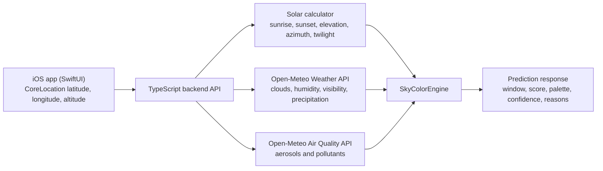

# Sky Color Prediction Architecture

This document describes the architecture and data requirements for predicting sunrise and sunset sky colors in the Youki iOS application.

It is an architecture and research document, not an implementation plan.

Open-Meteo field names and endpoint choices in this document were checked against the official Open-Meteo docs on 2026-08-10.

## 1. Product Goal

The product goal is to tell a user how promising an upcoming sunrise or sunset will be at their exact location, then explain why.

For Youki, a useful prediction is not just "good" or "bad." The backend should return:

- a prediction for the next sunrise and next sunset
- an estimated color profile such as muted, pastel, warm, vivid, or dramatic
- a confidence score
- a short explanation tied to the weather and atmospheric inputs
- the most relevant time window, not only the exact sunrise or sunset timestamp

The feature should begin with a physics-aware heuristic engine, then leave room for a future learned ranking model once we have user feedback and observed outcomes.

## 2. High-Level Architecture



Recommended responsibility split:

- iOS app:
  - Collect latitude, longitude, and altitude from CoreLocation.
  - Request sunrise and sunset predictions from the backend.
  - Render the prediction, confidence, and explanation.
- TypeScript backend:
  - Be the single source of truth for solar calculations and external API aggregation.
  - Fetch and normalize Open-Meteo weather and air-quality data.
  - Compute derived features.
  - Run the SkyColorEngine and return a compact prediction payload.

The backend should own solar geometry even if Open-Meteo can return `sunrise` and `sunset` as daily values. That keeps `sunrise`, `sunset`, `sun elevation`, `sun azimuth`, and `twilight phases` internally consistent.

## 3. Required Variables

The system needs three groups of inputs:

- client location inputs
- backend-calculated solar inputs
- external weather and atmospheric inputs

### Client Inputs

| Variable | Source | Notes |
| --- | --- | --- |
| latitude | iOS CoreLocation | Required for all calculations and API calls. |
| longitude | iOS CoreLocation | Required for all calculations and API calls. |
| altitude | iOS CoreLocation | Should be passed to the solar calculator and to Open-Meteo weather downscaling via `elevation` when appropriate. |

### Solar Inputs Calculated by Backend

| Variable | Source | Notes |
| --- | --- | --- |
| sunrise | Backend solar calculator | Use as the local morning event anchor. |
| sunset | Backend solar calculator | Use as the local evening event anchor. |
| sun elevation | Backend solar calculator | Needed to score color potential across the full event window, not just at the exact event time. |
| sun azimuth | Backend solar calculator | Helps reason about viewing direction, horizon exposure, and future terrain-aware logic. |
| twilight phases | Backend solar calculator | Compute civil, nautical, and astronomical twilight boundaries. |

Recommended twilight definitions:

- civil twilight: sun elevation from 0 to -6 degrees
- nautical twilight: sun elevation from -6 to -12 degrees
- astronomical twilight: sun elevation from -12 to -18 degrees

## 4. Data Source for Each Variable

### Weather API Source

Use the Open-Meteo Weather Forecast API:

- Endpoint: `https://api.open-meteo.com/v1/forecast`
- Recommended parameters:
  - `latitude`
  - `longitude`
  - `elevation`
  - `timezone=auto`
  - `hourly=cloud_cover,cloud_cover_low,cloud_cover_mid,cloud_cover_high,visibility,relative_humidity_2m,dew_point_2m,precipitation`
  - `daily=sunrise,sunset`

### Air Quality API Source

Use the Open-Meteo Air Quality API:

- Endpoint: `https://air-quality-api.open-meteo.com/v1/air-quality`
- Recommended parameters:
  - `latitude`
  - `longitude`
  - `timezone=auto`
  - `hourly=aerosol_optical_depth,pm2_5,pm10,dust,ozone`

### Variable Mapping

| Product Variable | Open-Meteo Field | Source |
| --- | --- | --- |
| total cloud cover | `cloud_cover` | Weather API |
| low cloud cover | `cloud_cover_low` | Weather API |
| mid cloud cover | `cloud_cover_mid` | Weather API |
| high cloud cover | `cloud_cover_high` | Weather API |
| visibility | `visibility` | Weather API |
| humidity | `relative_humidity_2m` | Weather API |
| dew point | `dew_point_2m` | Weather API |
| precipitation | `precipitation` | Weather API |
| aerosol optical depth | `aerosol_optical_depth` | Air Quality API |
| PM2.5 | `pm2_5` | Air Quality API |
| PM10 | `pm10` | Air Quality API |
| dust | `dust` | Air Quality API |
| ozone | `ozone` | Air Quality API |
| sunrise | `sunrise` or backend solar calculator | Prefer backend solar calculator as the authoritative source. |
| sunset | `sunset` or backend solar calculator | Prefer backend solar calculator as the authoritative source. |
| sun elevation | backend solar calculator | Not supplied by Open-Meteo in the requested data set. |
| sun azimuth | backend solar calculator | Not supplied by Open-Meteo in the requested data set. |
| twilight phases | backend solar calculator | Not supplied by Open-Meteo in the requested data set. |

## 5. Why Each Variable Matters

The reasoning below is the product and physics interpretation for SkyColorEngine, not a claim that Open-Meteo itself predicts color.

| Variable | Why it matters for sunrise and sunset color |
| --- | --- |
| sunrise | Anchors the morning event and defines when the sun first reaches the horizon. Color often peaks shortly before and shortly after this moment. |
| sunset | Anchors the evening event. Strong afterglow often appears after the official sunset time, so the engine should score a wider window around it. |
| sun elevation | The most important geometric input. Warm reds and oranges usually intensify when the sun is near or just below the horizon because the light path through the atmosphere is longer. |
| sun azimuth | Indicates where the light is coming from along the horizon. This matters for future terrain masking, coastline orientation, mountain horizons, and view-direction guidance. |
| twilight phases | Help define the useful viewing window. Many strong color events happen during civil twilight, and some afterglow extends deeper into twilight. |
| total cloud cover | Sets the overall openness of the sky. Too much cloud blocks direct low-angle light; too little cloud can reduce reflective texture. Moderate, broken cover is often best. |
| low cloud cover | Low clouds near the horizon can fully block the sunlight needed for sunrise or sunset color, especially when they form a solid wall. |
| mid cloud cover | Mid-level clouds can catch warm light and add structure, but dense layers can also mute the horizon and reduce contrast. |
| high cloud cover | High thin clouds are often the most favorable for vivid pink, orange, and red skies because they stay sunlit when the surface is already in shadow. |
| visibility | A practical proxy for haze, mist, and suspended particles. Very low visibility usually reduces clarity, but modest haze can enhance warm scattering. |
| humidity | High humidity increases water vapor and droplet formation, which can soften contrast, create pastel color, or push the scene toward haze. |
| dew point | Helps estimate near-saturation conditions. When air temperature and dew point are close, fog or mist becomes more likely and can hide color near the horizon. |
| precipitation | Active precipitation usually means thicker cloud and weaker direct illumination. However, conditions can improve after precipitation once clouds break and the air clears. |
| aerosol optical depth | The strongest direct proxy in this list for atmospheric haze and particle loading. Moderate aerosol loading often boosts warm scattering; very high loading can flatten the scene into dull haze. |
| PM2.5 | Fine particles scatter short wavelengths efficiently and are strongly associated with orange and red glows, but too much can reduce sharpness and brightness. |
| PM10 | Coarser particles increase haze and diffuse light. They matter, but usually less selectively than PM2.5 for color quality. |
| dust | Dust often produces especially warm red and orange sunsets because mineral aerosols strongly affect long-path scattering. |
| ozone | A secondary atmospheric composition signal. It can help explain short-wavelength absorption and color balance, though it is usually a weaker predictor than aerosols and clouds. |

## 6. MVP Variables vs Future Variables

### MVP Variables

These are enough to ship a first useful version:

- latitude
- longitude
- altitude
- sunrise
- sunset
- sun elevation
- twilight phases
- total cloud cover
- low cloud cover
- mid cloud cover
- high cloud cover
- visibility
- relative humidity
- dew point
- precipitation
- aerosol optical depth

Why this MVP works:

- solar geometry defines the event timing and scoring window
- cloud layers explain whether light can reach and illuminate the atmosphere
- visibility, humidity, dew point, and aerosol optical depth cover the largest haze and scattering effects

### Future Variables

These should be added after the MVP is stable:

- sun azimuth
- PM2.5
- PM10
- dust
- ozone
- shortwave radiation or direct radiation, if later needed
- wind speed and wind direction, if cloud movement becomes important
- terrain or horizon obstruction data
- camera-derived or user-rated observed sky outcomes

Why these are future variables:

- they improve nuance more than baseline usefulness
- some act as secondary proxies rather than primary drivers
- they become more valuable once the team starts calibrating against real-world outcomes

## 7. Suggested TypeScript Data Model

```ts
export type SkyEventKind = "sunrise" | "sunset";

export interface LocationInput {
  latitude: number;
  longitude: number;
  altitudeMeters: number | null;
}

export interface SolarEventWindow {
  kind: SkyEventKind;
  eventTimeIso: string;
  civilTwilightStartIso: string;
  civilTwilightEndIso: string;
  nauticalTwilightStartIso: string;
  nauticalTwilightEndIso: string;
  bestWindowStartIso: string;
  bestWindowEndIso: string;
}

export interface SolarSample {
  timeIso: string;
  elevationDegrees: number;
  azimuthDegrees: number;
  twilightPhase: "day" | "civil" | "nautical" | "astronomical" | "night";
}

export interface WeatherSample {
  timeIso: string;
  cloudCoverPct: number | null;
  cloudCoverLowPct: number | null;
  cloudCoverMidPct: number | null;
  cloudCoverHighPct: number | null;
  visibilityMeters: number | null;
  relativeHumidityPct: number | null;
  dewPointC: number | null;
  precipitationMm: number | null;
}

export interface AirQualitySample {
  timeIso: string;
  aerosolOpticalDepth: number | null;
  pm2_5UgM3: number | null;
  pm10UgM3: number | null;
  dustUgM3: number | null;
  ozoneUgM3: number | null;
}

export interface SkyColorFeatures {
  solar: SolarSample;
  weather: WeatherSample;
  airQuality: AirQualitySample;
}

export interface SkyColorPrediction {
  kind: SkyEventKind;
  score: number;
  confidence: number;
  label: "muted" | "pastel" | "warm" | "vivid" | "dramatic";
  dominantColors: string[];
  reasons: string[];
  window: SolarEventWindow;
}

export interface SkyColorApiResponse {
  location: LocationInput;
  generatedAtIso: string;
  predictions: SkyColorPrediction[];
}
```

Notes:

- Keep raw external fields separate from derived features.
- Use nullable numbers because Open-Meteo coverage can vary by model and region.
- Return both a numeric score and a human-readable label.

## 8. Suggested API Request Flow

### Client to Backend

1. The iOS app gets `latitude`, `longitude`, and `altitude` from CoreLocation.
2. The app calls a backend endpoint such as `POST /sky-color/predictions`.
3. The request includes:
   - location
   - target date, or a flag such as "next sunrise and sunset"

### Backend Processing

1. Validate and normalize the location.
2. Compute solar events and solar samples for the target date.
3. Call Open-Meteo Weather Forecast API for hourly weather fields and daily `sunrise` and `sunset`.
4. Call Open-Meteo Air Quality API for hourly atmospheric fields.
5. Align the weather and air-quality samples onto the solar timeline.
6. Build derived features for the event windows around sunrise and sunset.
7. Run the SkyColorEngine scoring logic.
8. Return the ranked sunrise and sunset predictions with reasons and confidence.

### Recommended Timing Strategy

- Compute solar geometry at finer resolution than the external forecasts, such as every 5 minutes.
- Pull weather and air-quality data at hourly resolution.
- Interpolate or nearest-fill external values across the finer solar timeline.
- Score a full window, not just one timestamp:
  - sunrise window: about 45 to 60 minutes before sunrise through 30 minutes after
  - sunset window: about 30 minutes before sunset through 60 to 75 minutes after

### Caching and Reliability

- Cache Open-Meteo responses by rounded location and forecast hour.
- Keep the solar calculator deterministic and local to the backend.
- If one external source is missing data, degrade gracefully and lower confidence instead of failing the request.

## 9. Open Questions for the Future SkyColorEngine

- Should sunrise and sunset predictions be purely heuristic at first, or should we calibrate a weighted score using historical observations before launch?
- How should the engine handle local horizon obstruction from mountains, buildings, or trees?
- Should the app ask for the user-facing viewing direction, or infer it from terrain and azimuth?
- How much post-sunset and pre-sunrise time should be included for different climates and seasons?
- Should aerosol optical depth be the primary atmospheric weight, with PM2.5, PM10, dust, and ozone used only as refinements?
- How should the engine behave when weather and air-quality timestamps do not line up exactly?
- Should we favor global consistency or region-specific tuning for desert, coastal, humid, alpine, and urban environments?
- Do we want to store anonymous prediction outcomes and user ratings so the model can be improved over time?
- Should future versions include terrain, satellite cloud imagery, or camera verification to validate the prediction?
- What explanation style is most useful to users: a numeric score, a color label, a short sentence, or all three?

## Recommended First Version

The first version should be a backend-owned heuristic engine that combines:

- solar geometry
- layered cloud cover
- visibility and moisture signals
- aerosol optical depth

That combination is small enough to build quickly, but strong enough to produce useful and explainable sunrise and sunset predictions for the iOS app.
