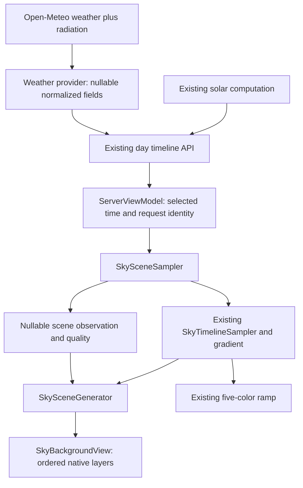

# Sunlight and clouds for the Youki sky

Status: Implemented; retained as design rationale and behavior contract

Updated: 2026-09-25

Implementation handoff: [Detailed implementation steps](sunlight-clouds-implementation-plan.md)

## Quick read

Keep the existing sky colors and add a native scene containing a sun disc, soft direct light, twilight glow, layered clouds, and a restrained atmospheric veil. Reuse the solar positions and cloud cover already in the day timeline; enrich the existing Open-Meteo request with three radiation fields to distinguish strong direct sunlight from diffuse light. No second weather service or image-generation service is needed.

The app already accounts for the sun's elevation and cloud cover in its gradient. What is missing is a richer visual representation and an explicit distinction between the sun being above the horizon and sunlight reaching the viewer through clouds. The new scene will be an aesthetic forecast, not a reconstruction of the exact clouds overhead.

The design is implemented in the backend and SwiftUI client. See the [implementation plan](sunlight-clouds-implementation-plan.md) and [dated delivery report](artifacts/2026-09-25-sunlight-clouds.md) for actual scope, verification, and remaining QA.

| Changed surface in this handoff | Status | Contents |
| --- | --- | --- |
| This design | Implemented | Sources, architecture, contracts, visual rules, limitations |
| [Implementation plan](sunlight-clouds-implementation-plan.md) | Implemented | Ordered work, acceptance criteria, actual verification notes |
| Application, tests, configuration | Implemented | Additive radiation contract, native sky scene, fixtures, regressions |

## Problem, scope, and assumptions

The background should make clear sunshine, thin cloud, broken cloud, overcast, and twilight feel different even when their underlying color palettes are similar. Sunlight should have a source and softness; clouds should have density, depth, and subtle lighting. The selected time must drive every component together.

Goals:

- Preserve the nine-stop gradient and five-color ramp that the user already likes.
- Add convincing sunlight and clouds using existing inputs wherever possible.
- Handle the entire day, including polar days/nights and missing milestones.
- Make unavailable or stale data visibly distinct from a reliable sunny forecast.
- Keep drawing deterministic, lightweight, and native to iOS 17+.

Non-goals: exact cloud placement, camera/AR alignment, terrain or building shadows, volumetric weather simulation, a new scoring algorithm, a seven-day calendar integration, moon/stars, rain particles, or a new image asset pipeline. The base gradient's existing night-color calibration is a separate issue; this change guarantees no solar disc or daylight illumination at night, not a physically calibrated night palette.

Assumptions: use a restrained illustration matching the current UI, with a small sun disc rather than a weather icon. The composition looks toward the sun, so it needs no compass permission. These are proposed defaults, not user-approved visual mockups. Illustrations remain forecasts even when the selected moment is Now.

## Implemented current state and evidence

Source inspection is the authority for these facts. Some older prose in [current-state.md](current-state.md), [the iOS README](../frontend/README.md), and [.codex/project-context.md](../.codex/project-context.md) lags the current code.

| Area | Implemented behavior | Canonical evidence |
| --- | --- | --- |
| Weather acquisition | Requests total/low/mid/high cloud cover, visibility, humidity, dew point, precipitation, and UV; missing values are nullable | [Weather provider](../server/src/infrastructure/open-meteo/open-meteo-weather-provider.ts), [domain](../server/src/domain/weather.ts) |
| Solar geometry | Calculates apparent elevation and azimuth, including refraction; timeline sunrise crossing uses apparent elevation -0.267 degrees | [Solar position](../server/src/infrastructure/solar/solar-position.ts), [solar events](../server/src/infrastructure/solar/solar-events.ts) |
| Day response | Returns solar, weather, and air-quality grids separately, with a location timezone, local target day, UTC generation time, and nullable milestones | [Timeline contract](../server/src/domain/sky-day.ts), [service](../server/src/application/services/sky-day-timeline-service.ts) |
| Local appearance | Swift interpolates a selected minute and generates nine colors, a ramp, cloud bands, and glow; missing cloud values use zero defaults for legacy appearance parity | [SkyGradient.swift](../frontend/YoukiApp/SkyGradient.swift) |
| Current cloud drawing | Up to three blurred, wide ellipses at fixed heights; cloud opacity comes from cover | [SkyBackgroundView.swift](../frontend/YoukiApp/SkyBackgroundView.swift) |
| Current sunlight | Glow stays at x=0.5, y=0.89, has fixed warm colors, and is drawn after clouds; no separate sun disc or radiation input | [Generator](../frontend/YoukiApp/SkyGradient.swift), [renderer](../frontend/YoukiApp/SkyBackgroundView.swift) |
| Selection/loading | One selected moment drives appearance and ramp; independent timeline/score results and request IDs protect location changes; a 60-second task updates local time | [ServerViewModel.swift](../frontend/YoukiApp/ServerViewModel.swift), [ContentView.swift](../frontend/YoukiApp/ContentView.swift) |
| Verification seams | Foundation-only models, a standalone regression runner, backend tests, and reference parity harness exist | [ModelRegression.swift](../frontend/YoukiApp/Tests/ModelRegression.swift), [parity harness](../scripts/verify-sky-parity.mjs), [backend tests](../server/src/infrastructure/engines/sky-gradient-engine.test.ts) |

Today the Swift sampler's fallback-status check covers the whole day, not just the selected observation. Its interpolation substitutes numeric defaults before interpolation, which is intentional legacy behavior. The new sunlight decisions must retain missingness instead of interpreting those defaults as evidence of clear skies.

## Resources and acquisition strategy

### Existing resources to reuse

Solar elevation answers whether the sun is above the apparent horizon. Cloud cover and visibility guide cloud density and atmospheric softness. Open-Meteo describes cloud cover as area fraction, with separate altitude layers; it is not a map of which cloud covers the sun. Weather values are model output, with coverage varying by model and region. [Open-Meteo forecast documentation](https://open-meteo.com/en/docs)

Use existing solar computation, rather than adding another astronomy API. Neither a sunrise/sunset Boolean nor UV index is a sufficient control for the appearance of direct sunlight.

### Proposed additional acquisition

Append these hourly variables to the existing backend weather request. The official forecast schema lists all three instant variants. [Open-Meteo forecast schema](https://github.com/open-meteo/open-meteo/blob/main/openapi/forecast.yml)

| Provider variable | Proposed domain field | Unit | Intended use |
| --- | --- | --- | --- |
| `direct_normal_irradiance_instant` | `solarRadiation.directNormalWm2` | W/m2 | Strength of direct light and disc definition |
| `shortwave_radiation_instant` | `solarRadiation.globalHorizontalWm2` | W/m2 | Overall daylight signal |
| `diffuse_radiation_instant` | `solarRadiation.diffuseHorizontalWm2` | W/m2 | Diffuse share and softness |

Use instant values at the indicated timestamp. The non-instant radiation fields are preceding-hour means; substituting them would introduce different timing semantics around sunrise/sunset. [Open-Meteo forecast documentation](https://open-meteo.com/en/docs)

Do not add weather codes, sunshine duration, wind, or a separate current-weather request to the first release. Codes are too coarse for visual density, interval sunshine duration cannot locate a cloud at a particular minute, and decorative cloud motion does not require wind. Future wind support must account for cloud-layer winds, not imply that surface wind describes every cloud.

**Unknown until implementation smoke checks:** useful non-null coverage of all three fields across target regions. Test Tokyo and at least one non-Japan location using Best Match. Lack of coverage must select cloud-based estimation, not block the scene. Do not select a fixed regional model solely to eliminate nulls.

### Access, costs, and artwork

Keep calls in the backend and reuse its configured provider. This adds response fields to one HTTP request, but it is not necessarily free in quota terms: the existing request has nine weather variables; the proposed request has twelve, and Open-Meteo counts larger variable selections toward additional call units. Confirm usage accounting before release. Its free access is for noncommercial evaluation; commercial deployment needs an appropriate plan. No purchase is required for this design. [Open-Meteo pricing and usage](https://open-meteo.com/en/pricing)

Provide an adjacent weather-source link and indicate that Youki derives the illustration from the data, following the provider's attribution instructions. Keep any commercial API credential server-side and out of logs. [Open-Meteo licence](https://open-meteo.com/en/licence)

Create clouds with deterministic paths/soft masks and use native gradients for light. There are no runtime stock-photo downloads or generated bitmaps. This keeps colors adaptable, removes image-fetch latency, and supports multiple screen sizes. Art-directed static textures may be evaluated later if procedural drawing cannot meet the visual target.

## Target architecture

The server remains responsible for acquisition and normalization. The client owns scene decisions and visual composition. There is no scene endpoint and no change to scoring ownership. The TypeScript gradient engine remains the legacy reference; the additional scene model is Swift-only.

### Component ownership

All new paths below are **proposed**, not files already present.

| Component | Responsibility | Likely surface |
| --- | --- | --- |
| Weather provider | Request extra fields, validate values/units, preserve nulls | Existing `server/src/domain/weather.ts`, `infrastructure/open-meteo/open-meteo-types.ts`, `open-meteo-weather-provider.ts` |
| Timeline DTO | Decode old and enriched responses | Existing `frontend/YoukiApp/SkyDayTimelineAPI.swift` |
| Scene sampler | Compose legacy appearance with a strict nullable observation at exactly the same minute | New `frontend/YoukiApp/SkySceneSampler.swift` |
| Scene generator | Turn observation into normalized sun, glow, clouds, veil, and quality | New `SkyScene.swift` and `SkySceneGenerator.swift` in the same directory |
| State owner | Hold selected scene, refresh policy, provenance and request identity | Existing `ServerViewModel.swift` |
| Renderer | Draw layers and resize them; no weather interpretation or networking | Existing `SkyBackgroundView.swift`; new `SkySunLayer.swift` and `SkyCloudLayer.swift` |
| Screen composition | Pass scene; retain layout, ramp, sheets, and accessibility | Existing `ContentView.swift`, relevant status in `ForecastComponents.swift` |

## Proposed contracts

### Backward-compatible wire extension

Keep the request and endpoint unchanged: `POST /api/v1/sky-day/timeline`.

Extend each `WeatherSample` with an optional `solarRadiation` object. New servers emit the object with `sampling: "instant"` and the three nullable numeric fields in the source table. Old servers may omit it; clients treat omitted, null, or an unsupported sampling value as unavailable radiation. This discriminator prevents a later mean-valued source from being silently interpreted as instant data.

Zero is a valid measurement, especially at night. Normalize non-numeric, non-finite, negative, absent, or unit-mismatched radiation values to null; do not replace them with zero. Add `hourly_units` to the provider response type and validate the three returned units. Cloud percentage clamping for the scene is 0...100. Upper radiation values are retained as data but visual outputs are bounded; no arbitrary upper physical cutoff is needed for drawing.

The TypeScript property should be optional for source compatibility with existing fixtures/providers. Swift fields are optional with an initializer/default strategy that preserves existing test fixture construction. Old iOS releases ignore the extra JSON keys. The shared weather type can also appear in prediction `features`; that is an additive payload change and must be covered by compatibility tests, with scoring results unchanged.

No database, stored preference, or migration is required.

### Client observation and appearance

`SkySceneObservation` contains selected local timestamp, solar apparent elevation/azimuth, nullable cloud cover by layer, nullable visibility/precipitation, the three nullable radiation values, and availability metadata. Do not feed zero-filled `SkyGradientInput` back into this observation.

`SkyScene` contains:

| Property | Meaning/invariant |
| --- | --- |
| `base: SkyAppearance` | Unmodified legacy stops/ramp and diagnostic legacy layers |
| `sun` | Optional descriptor: normalized center, radius fraction, visible limb fraction, disc opacity, halo radius/opacity/color; absent below horizon or without sufficient evidence |
| `horizonGlow` | Separate twilight light, independent of disc existence |
| `cloudLayers` | Ordered high/mid/low or generic layers with stable IDs, density, opacity, tint, softness, and deterministic geometry seed |
| `atmosphericVeil` | Optional low-contrast haze/fog presentation; no weather diagnosis |
| `quality` | Radiation-supported, cloud-estimated, or unavailable lighting; missing fields and interpolation/edge flags |
| `provenance` | Forecast, stale forecast, or decorative fallback; selected time and retrieval/generation age |

Keep model/generator files Foundation-only. Normalized coordinates and appearance values are finite; opacity/density are 0...1. A view applies these values to its measured size. A seeded drawing generator must use a documented stable algorithm, not Swift's process-randomized `Hasher`.

### Time and sampling rules

1. Resolve one selected timestamp using the existing returned timezone and minute precision. Both `base` and scene observation use it. Milestone selection stays pinned; Now follows the local clock.
2. Preserve existing gradient sampling/defaults through the existing `SkyTimelineSampler` API. Implement the stricter scene observation separately in `SkySceneSampler`; keep any shared parsing extraction behavior-preserving. This protects reference parity.
3. For scene numeric fields, interpolate two valid hourly values only when their gap is at most 90 minutes. At an exact timestamp, use that row. With only one valid adjacent value, hold it for at most 60 minutes and mark partial/held; otherwise return null. Never interpolate between zero and an invented replacement for missing data.
4. Radiation and cloud fields follow the same instant sampling rule. Do not interpolate sunshine-duration intervals, weather codes, or Booleans as numbers.
5. For a day-edge sample, permit a nearest hourly hold for at most 60 minutes with an edge flag. Reject unrelated dates. Do not extend yesterday's scene into today.
6. Use the existing adaptive solar grid; interpolate azimuth over the shortest angular arc if consumed by the scene. Do not change legacy gradient math for this fix.
7. Offset-free local timestamps cannot uniquely represent a repeated DST hour. If the target date contains a timezone offset transition or duplicate/ambiguous solar timestamps, fall back to the legacy scene and mark enhanced scene unavailable for that date. Adding unambiguous UTC timestamps is a future contract migration; this release must not claim DST correctness it cannot establish.

## Visual behavior and decision rules

These are **proposed artistic heuristics**, not probabilities of seeing the sun or calibrated physical laws. Put constants in one named style configuration and tune through the fixture matrix in the implementation plan.

### Sun position and daylight

Use apparent solar elevation; do not apply refraction again. Match the existing solar-events convention: no disc when its center is at or below -0.267 degrees. Between -0.267 and +0.267 degrees, reveal the disc's upper limb smoothly; fully reveal it above +0.267. This is a stylized emergence and should be tested against actual timeline milestones, not the old regression fixture's -0.833 placeholder.

Use a sun-facing composition: x=0.5, horizon y=0.86. Above the horizon, map elevation 0...90 degrees to y=0.86...0.14. Start with a disc radius of 0.025 times the shorter view dimension. During limb emergence, keep the center at the horizon and use a local disc mask for visible fraction; do not use an oversized artistic radius as an astronomical angular radius. The disc is intentionally larger than a physically scaled sun. No east-left/west-right rule or hemisphere assumption is needed.

### Direct and diffuse light

Compute geometry first, illumination second. Radiation can never produce a solar disc when geometry says the sun is below the horizon.

Suggested initial direct-light strength: smoothstep between DNI 20 and 500 W/m2. This is a bounded visual mapping, not a sunshine classification threshold. Valid zero DNI means direct light is suppressed; it must not trigger the missing-data fallback. If DNI is unavailable but cloud cover is usable, estimate strength from a cloud transmission heuristic and label it cloud-estimated.

An initial cloud-only transmission uses the product of `(1 - 0.9 * lowCover)`, `(1 - 0.6 * midCover)`, and `(1 - 0.25 * highCover)`, where cover is 0...1. If any required layer is missing, use total cover instead with `(1 - totalCover)^1.5`; if total cover is also missing, use only known layers, cap direct strength at 0.35, and mark partial. If all clouds and DNI are unavailable, omit the disc and direct halo.

When DNI exists, use it as the illumination signal rather than multiplying by the full cloud-only transmission again. Clouds still occlude through rendering. Apply a fog visibility limit using a smooth transition from 200 to 5,000 meters when visibility is known, and a conservative low-overcast disc cap approaching zero as low cover rises from 85% to 100%. These caps prevent a bright crisp disc in contradictory thick-cloud/fog fixtures. Record contradictory inputs as diagnostics. High cloud alone does not imply an opaque sky.

For softness, derive diffuse fraction as diffuse-horizontal / global-horizontal only when both are valid, global is at least 20 W/m2, and diffuse does not exceed global beyond a small numeric tolerance. Otherwise leave the ratio unavailable and derive softness from cloud layers. Never divide DNI by global-horizontal radiation: their planes differ. Bound the ratio to 0...1; it broadens the halo and softens edges, not the base gradient. Fade daylight halo and cloud highlights with solar elevation near the horizon.

Keep twilight horizon glow separate from direct radiation. It can remain below the horizon because the existing sunset/sunrise palette already models twilight. Reuse the legacy glow's intensity and warm tint for this layer initially, with a smooth fade to zero from apparent elevation -4 to -6 degrees. Do not apply a second cloud-darkening formula to this already weather-adjusted glow. At/below -6, both disc/direct halo and twilight glow are zero; cloud daylight highlights are also zero.

### Clouds and compositing

| Input regime | Proposed appearance |
| --- | --- |
| Little cloud | Mostly unobstructed gradient; few or no wisps; defined sun when direct light supports it |
| Mainly high cloud | Thin, wide translucent wisps; softer sun/halo; restrained warm tint near twilight |
| Mid/broken cloud | Separated soft masses, variable gaps and gentle illuminated edges |
| Dense low cloud | Broader opaque masses/continuous deck; sun occluded; flatter diffuse light |
| Very low visibility | Low-contrast veil; softened or absent disc; preserve readability |
| Night | Dark/subtle cloud silhouettes derived from base colors; no daylight highlights |
| Total cover only | Generic cloud deck; do not invent a confident altitude profile |

Cloud percentages overlap vertically; never add the three layers to obtain total cover or treat cover as exact pixel coverage. Use each value to control a bounded style density. Proposed ranges: high-layer opacity 0...0.25, mid 0...0.5, low 0...0.9, with a continuous low deck at very high coverage. Geometry should expand/fade continuously as coverage changes, using stable particle/path slots rather than popping a whole cloud into existence at a threshold.

Seed geometry by coarse location cell, target date, layer, and slot ID. Keep the seed stable across selected times and resizes. Time changes density/tint, not the random layout. Exact silhouettes and illuminated edges are illustrative; the data does not locate the real cloud in front of the sun.

Draw back to front:

1. Existing nine-stop gradient only.
2. Broad twilight horizon glow and diffuse ambient illumination.
3. Direct sun halo and disc.
4. High-cloud wisps, then mid-cloud masses, then low-cloud deck.
5. Subtle atmospheric veil, followed by existing app foreground/contrast treatments.

The enhanced renderer replaces legacy cloud ellipses and the legacy topmost glow; it must not draw both systems. Clouds in front of the sun should attenuate the disc through normal alpha/masking. Avoid a separate whole-scene darkening pass: the gradient already responds to cloud cover. Cloud highlights are low-opacity tints tied to sun strength/twilight, not white outlines.

Retain a small, themed contrast scrim where foreground text needs it. Do not recolor all app chrome from radiation values. The five-color ramp continues to describe the background atmosphere and is not a screenshot average including white sun pixels.

## Loading, failures, freshness, and performance

| Situation | Required behavior |
| --- | --- |
| Radiation missing; clouds available | Cloud-estimated scene; sky remains usable; no endpoint failure |
| Cloud layers missing; total available | Generic cloud cover; partial quality |
| All lighting evidence absent | Base colors with no evidence-based disc; label limited weather data |
| Timeline unavailable | Existing fallback/loading presentation; no live scene label or invented live conditions |
| Score API fails | Keep timeline scene; score remains unavailable |
| New location starts loading | Clear old location's scene; request identity rejects late results |
| Same-location refresh fails | Keep last scene for the same day, mark stale, allow retry; do not relabel old data as newly fetched |
| Local midnight | Refetch the new day; never sample the old timeline under today's date |

Retain a minute-level render update. Add a forecast refresh when the app becomes active and data is older than 30 minutes, and while foregrounded at the next minute tick after that age. Coalesce requests, allow only one refresh per location/day, and wait at least five minutes after a failed automatic refresh. These are proposed product freshness thresholds; they do not claim a provider update every 30 minutes. Store an in-memory successful retrieval time as well as `generatedAtIso`; the latter is response creation time, not weather-model initialization time.

Keep milestone selection during same-day refresh when the milestone still exists; otherwise choose Now or a real available milestone and update the selected-time label. A location change uses the current reset behavior. Cancel foreground timers when inactive; no background polling, per-tap fetch, or cloud-animation fetch. Do not replay the initial loading reset for routine same-location refreshes.

Start with static clouds and short transitions between appearances. Disable transitions for Reduce Motion and support reduced transparency/stronger contrast without hiding forecast status. Bound drawing to three cloud layers, at most 24 reusable shapes total, two broad light gradients, and one veil. Cache paths; avoid large per-shape blur passes. Profile before adding animation, Metal, or raster caches. The expanded sky uses the same normalized scene, preserving current clipping/safe areas.

No new persistence, sensors, or location permissions. For diagnostics record field availability, selected quality, cache age, response latency, and scene-generation duration without coordinates or full provider URLs. Use debug diagnostics initially; no analytics service is required.

## Alternatives, risks, and open questions

| Decision | Chosen approach | Alternative and tradeoff |
| --- | --- | --- |
| Data source | Enrich existing Open-Meteo adapter | Another provider adds authentication, alignment and cost; evaluate only if target-region coverage is inadequate |
| Light inference | DNI with a cloud fallback and geometry gate | Cloud-only is a viable first slice, but cannot express direct/diffuse light as well |
| Rendering | Native, deterministic 2D layers | Photographs lose continuity; volumetric shaders increase implementation and battery cost |
| Scene ownership | Swift scene over unchanged legacy gradient | Porting the whole scene to TypeScript adds parity work without a current consumer |
| Orientation | Sun-facing composition | Compass alignment needs camera/viewing geometry, permissions, and hemisphere-aware projection |
| Validation | Synthetic scenarios plus live contract smoke | Live screenshots alone cannot reliably reproduce rare conditions |

Main risks are hourly forecasts missing fast-moving local cloud changes, uncertain cloud optical thickness, contradictory radiation/cloud values, and excessive cloud/blur contrast hiding the palette. Mitigate with honest forecast language, nullable contracts, conservative caps, deterministic scenario review, and an enhanced/legacy rendering switch during rollout.

Open questions are nonblocking with the defaults above: final cloud art style; whether commercial API access is already configured; actual radiation coverage in target markets; and visual/performance calibration on the oldest supported physical device. Neither this design nor a scene quality label establishes meteorological accuracy.

Future work: UTC timestamps for DST-safe sampling, calibrated clear-sky radiation normalization, region-specific evaluation, optional cloud animation, and satellite/nowcast integration if minute-level cloud fidelity becomes a product requirement. These are excluded from the first implementation.

## Verification and handoff status

Verified during this documentation task: source and repository instructions inspected; initial Git worktree clean; provider field names and current access/attribution documentation reviewed. The [implementation plan](sunlight-clouds-implementation-plan.md) defines required tests and visual evidence.

| Handoff check | Observed result |
| --- | --- |
| Python path/anchor check across both new documents | All 46 internal links resolved; no non-ASCII or unintended trailing-whitespace issues |
| `git diff --check` and `git diff --no-index --check` for each new document | Passed after removing Markdown hard-break trailing spaces |
| `git status --short` | Only these two new Markdown documents; no application changes |
| Application tests/builds/provider smoke | Not run; this task produces design documentation only |

Not implemented or verified: provider response coverage, new API fields, new renderer, refreshed state behavior, screenshots, runtime tests, builds, physical-device performance, and commercial configuration. No agents were delegated work in this task. Historical test results in [the previous integration artifact](artifacts/2026-09-25-ios-live-sky-integration.md) are context only; that artifact records two failing UI assertions which the implementer must rebaseline.
